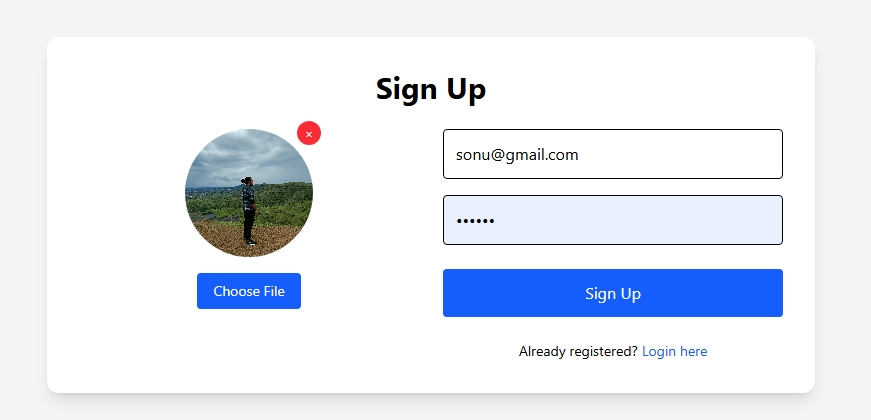
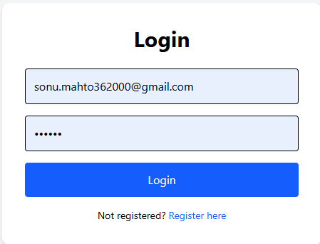
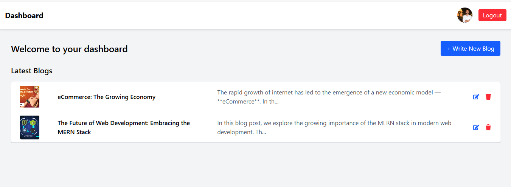
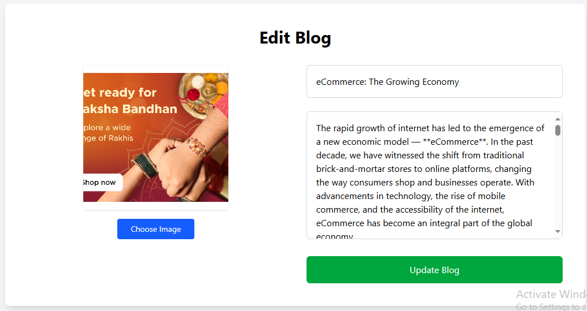
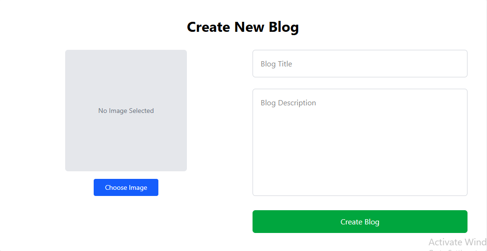

# Blog CRUD Application 📝

A full-stack blog application that allows users to sign up, log in, create, read, update, and delete blog posts. The application utilizes JWT (JSON Web Token) authentication for user login and allows users to manage their blogs efficiently.

## Features ✨

### 1. **Sign Up Page 🧑‍💻**
   - A form to register a new user.
   - Fields: **Email 📧**, **Password 🔑**, **Profile Image 📸** upload.
   - Upon successful registration, the user is redirected to the Login page.

### 2. **Login Page 🔐**
   - Users can log in using their **Email 📧** and **Password 🔑**.
   - JWT token is generated upon successful login.
   - The user is redirected to the Dashboard page upon successful authentication.

### 3. **Dashboard Page 📊**
   - Displays the logged-in user’s profile image (from the JWT token).
   - Allows the user to perform CRUD operations on blog posts.

### 4. **CRUD Functionality ✍️**
   - **Create 📝**: Users can create a new blog post.
   - **Read 👀**: Users can view a list of their blogs.
   - **Update ✏️**: Users can edit their blog posts.
   - **Delete ❌**: Users can delete their blog posts.

### 5. **Blog View Button 🔍**
   - Users can view the full content of a blog post by clicking the "View" button.

## Screenshots 📸

### Sign Up Page

### Login Page

### Dashboard Page

### Blog CRUD Functionality

## Technologies Used 🛠️
- **Frontend**: React ⚛️, Vite ⚡, Tailwind CSS 🎨
- **Backend**: Node.js 🟩, Express 🧑‍💻
- **Database**: MongoDB 🌱
- **Authentication**: JWT (JSON Web Token) 🔑
- **File Upload**: Multer for handling file uploads 📂

